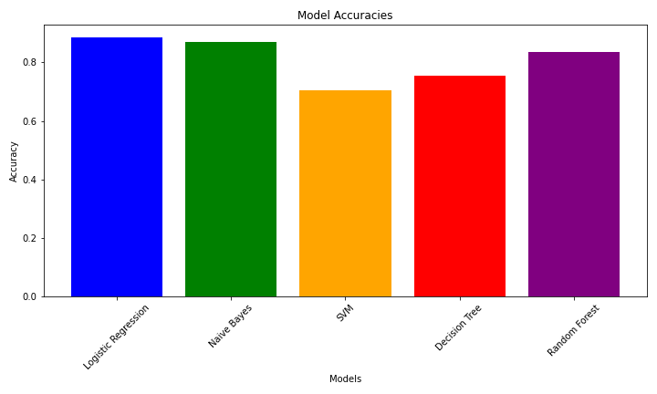

# Heart Disease Prediction using Machine Learning

## Overview
This project aims to predict whether a patient has heart disease based on various clinical features. The dataset used contains information about patients' cardiac health, and several machine learning models are applied to classify whether a patient has heart disease or not.

## Dataset
The dataset contains the following features:
- **age**: Age of the patient.
- **sex**: Gender of the patient (0: female, 1: male).
- **cp**: Type of chest pain (0-3).
- **trestbps**: Resting blood pressure.
- **chol**: Serum cholesterol.
- **fbs**: Fasting blood sugar > 120 mg/dl.
- **restecg**: Resting electrocardiographic results.
- **thalach**: Maximum heart rate achieved.
- **exang**: Exercise-induced angina.
- **oldpeak**: ST depression induced by exercise relative to rest.
- **slope**: Slope of the peak exercise ST segment.
- **ca**: Number of major vessels colored by fluoroscopy.
- **thal**: Thalassemia (0 = normal; 1 = fixed defect; 2 = reversible defect).
- **target**: The target variable (1 = heart disease, 0 = no heart disease).

## Models Used
The following supervised learning models were implemented:
1. **Logistic Regression**
2. **Naive Bayes**
3. **Support Vector Machine (SVM)**
4. **Decision Tree**
5. **Random Forest**
